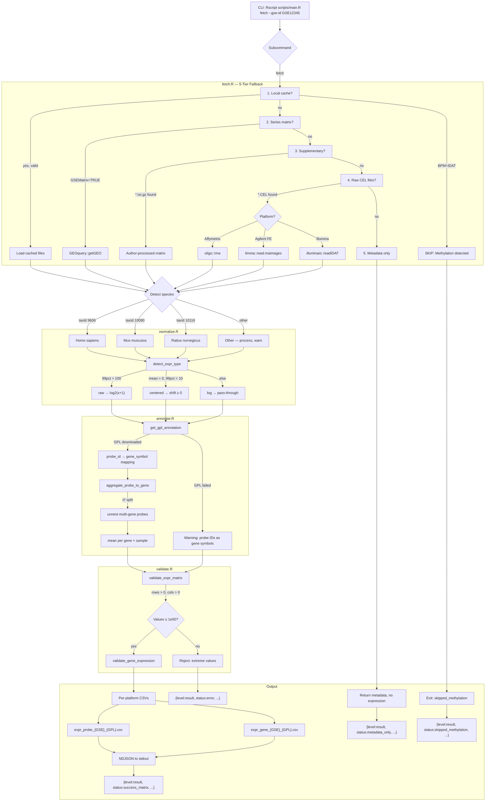

# geo-microarray-processing — Design Doc

**Date:** 2026-06-10  
**Status:** Approved  
**Pipeline:** superpowers brainstorming → writing-plans → OpenSpec (/opsx:apply with TDD)

## Overview

This node fetches and processes GEO microarray expression data, adapted from the reference implementation in `original/geo-microarray-fetch.zip` to the IRE node-package v2 format. The original is a 779-line R script that already covers fetch, normalization, probe-to-gene aggregation, and validation. The port is primarily structural: single-entry `main.R` with subcommand dispatch, NDJSON reporting, and a declarative `env.yaml`.

## Decisions

| Decision | Choice | Rationale |
|---|---|---|
| Scope | Fetch + QC + clean | Matches original scope; QC/clean added as incremental changes |
| Language | R + Bioconductor | Deep dependency on `oligo::rma()`, `limma::read.maimages()`, `GEOquery`, `Biobase::ExpressionSet` — no Python equivalents |
| Architecture | Functional modules (Option B) | Minimal abstraction, close to original code, fits Bioconductor idioms. `main.R` dispatcher + `fetch.R`, `normalize.R`, `annotate.R`, `validate.R`, `report.R` |
| Subcommands | `fetch`, `qc`, `clean` (Option A) | Each independently callable; orchestrator wires them. Agents get per-stage decision points for error handling |
| Multi-platform output | Per-platform files (Option A) | Established pattern (both `virtualArray` and `crossmeta` expect per-platform input). Merging deferred to a separate merge node |
| R versions | 4.3 / BioC 3.18 (prod) + 4.5 / BioC 3.20 (forward-compat) | Bioconductor is tightly coupled to R version; test both |
| Conda channels | Upstream only in `env.yaml` | Mirrors configured locally via `conda config`, never committed |
| Testing | Hybrid (Option C) | Pure functions → unit tests; stateful modules → module-level with fixture RDS; `main.R` dispatch → integration tests |
| Annotation | 4-tier fallback with AnnoProbe | fData → GPL table → AnnoProbe pipe → probe IDs; handles GB_ACC-only platforms like GPL16686 |
| Dev approach | TDD per OpenSpec change | Sequential pipeline-shaped work; CLAUDE.md mandates TDD |
| API key | `NCBI_API_KEY` env var, fallback to `--api-key` config | No hardcoded secrets; runtime resolution |
| Proxy | `--proxy` with `bind: config` | Original hardcoded `localhost:1086` removed |
| Species | Human (9606), mouse (10090), rat (10116) as tier-1; others pass-through with warning | Most GEO expression data is from these three; species-specific annotation packages |

## Architecture

### Package Structure

```
geo-microarray-processing@1.0.0/
├── SKILL.md                   # Agent contract (frontmatter) + narrative
├── env.yaml                   # Conda env: R 4.3 + Bioconductor 3.18
├── env-4.5.yaml               # Forward-compat: R 4.5 + Bioconductor 3.20
├── scripts/
│   ├── main.R                 # Single entry point, subcommand dispatch
│   ├── fetch.R                # GEO download, 5-tier fallback, platform detection
│   ├── normalize.R            # detect_expr_type, normalize_expr_matrix, RMA
│   ├── annotate.R             # GPL annotation download, probe-to-gene aggregation
│   ├── validate.R             # CEL integrity, matrix QC, gene expression validation
│   └── report.R               # NDJSON output helpers
├── tests/
│   ├── testthat/
│   │   ├── test-fetch.R
│   │   ├── test-normalize.R
│   │   ├── test-annotate.R
│   │   ├── test-validate.R
│   │   ├── test-report.R
│   │   ├── test-main.R
│   │   └── helpers.R
│   └── fixtures/
│       ├── GSE100155_eset.rds
│       ├── GSE12345_eset_list.rds
│       ├── GSE_methylation_meta.rds
│       ├── cel_valid.rds
│       ├── cel_corrupted.rds
│       ├── gpl570_annotation.rds
│       ├── expr_raw.rds
│       ├── expr_centered.rds
│       └── expr_log.rds
└── references/
    ├── ERROR_CODES.md
    └── PLATFORMS.md
```

### Data Flow (fetch subcommand)

```
GEO Database
    │
    ▼
fetch.R        5-tier fallback (local → series matrix → suppl → raw → meta)
               Platform detection (Affy/Agilent/Illumina), methylation skip
    │ expr_matrix (probes × samples)
    ▼
normalize.R    detect_expr_type() → raw|centered|log
               normalize_expr_matrix() → log2(x+1), shift ≥ 0
    │
    ▼
annotate.R     get_gpl_annotation() → probe-to-gene mapping
               aggregate_probe_to_gene() → gene-level (mean aggregation, /// split)
    │
    ▼
validate.R     validate_expr_matrix(), validate_gene_expression()
    │
    ▼
Output         Per-platform CSV files:
               ├── expr_probe_{gse_id}_{gpl}.csv
               └── expr_gene_{gse_id}_{gpl}.csv
               
               NDJSON to stdout:
               {"level":"info","msg":"..."}
               {"level":"result","status":"...",...}
```

## Species Support

The node detects organism from GEO metadata (`experimentData(eset)@other$sample_taxid`) and routes to the appropriate annotation database:

| TaxID | Species | Annotation Package | Tier |
|---|---|---|---|
| 9606 | *Homo sapiens* | `org.Hs.eg.db` | 1 — primary |
| 10090 | *Mus musculus* | `org.Mm.eg.db` | 1 — primary |
| 10116 | *Rattus norvegicus* | `org.Rn.eg.db` | 1 — primary |
| Other | Any | GPL table gene symbols only | 2 — pass-through with warning |

Tier-1 species get validated gene symbol mapping against the species annotation database. Tier-2 (other) species use the annotation fallback chain below.

### Gene Annotation Fallback Strategy (5-Tier)

Some platforms lack direct gene symbol columns in their annotation. Common patterns:

| Platform Example | Issue | Solution |
|---|---|---|
| GPL16686 | Only `GB_ACC` (GenBank accession) in GPL table | AnnoProbe pipe alignment (Tier 4) |
| GPL17586 | `gene_assignment` column instead of `Gene Symbol` | Parse `"NM_// SYMBOL // ..."` (Tier 2) |
| Unknown GPL | No annotation columns at all | Probe IDs as gene symbols (Tier 5) |

The annotation module tries five sources in order:

```
1. fData() direct column          — Gene Symbol / GENE_SYMBOL / Symbol
2. fData() gene_assignment        — parse "ACC // SYMBOL // desc // ..." → extract field 2
3. GPL annotation table           — GEOquery::Table(getGEO(GPL))
4. AnnoProbe pipe alignment       — probe FASTA → genome → GENCODE (147 platforms)
5. Probe IDs as gene symbols      — last resort, with warning
```

**`gene_assignment` parsing**: The standard Affymetrix format is `"Accession // Symbol // Description // ..."` where fields are separated by ` // ` (space-double-slash-space). The extraction function splits on this delimiter and takes the second field.

```r
extract_gene_from_assignment <- function(x) {
  parts <- strsplit(as.character(x), " // ", fixed = TRUE)
  vapply(parts, function(p) if (length(p) >= 2) trimws(p[2]) else NA_character_, "")
}
```

**AnnoProbe** (`r-annoprobe`, CRAN) covers 147 expression array platforms across human/mouse/rat with three annotation modes. The `pipe` mode (probe sequences aligned to reference genome, annotated via GENCODE) provides the most complete and up-to-date gene symbol coverage, especially for platforms like GPL16686 where the GPL table only has GB_ACC.

## Test Datasets

Six real GEO datasets selected to cover all code paths:

| # | GSE | Species | Platform | Samples | Tests |
|---|---|---|---|---|---|
| 1 | **GSE318047** | Human | GPL570 | 12 | Standard annotation (Gene Symbol in fData) |
| 2 | **GSE156508** | Human | GPL16686 | 12 | No gene symbol — GB_ACC only, tests AnnoProbe fallback |
| 3 | **GSE11381** | Mouse | GPL339 | 12 | Mouse single-platform |
| 4 | **GSE4105** | Rat | GPL85 | 6 | Rat single-platform |
| 5 | **GSE84422** | Human | GPL96+97+570 | ~51 | Multi-platform (3 GPLs in one series) |
| 6 | **GSE42861** | Human | GPL13534 (450k) | ~12 | Methylation skip (BPM+IDAT) |

All three tier-1 species, six distinct platforms, annotation-rich (GPL570) vs annotation-sparse (GPL16686), multi-platform output, and methylation detection — all exercised with real, publicly available data.

## Handling Logic (Mermaid)



## SKILL.md — Skill-Like Node Structure

The SKILL.md body narrative follows the skill pattern from the original reference, adapted to node-package v2 conventions:

**Body sections** (human/LLM narrative, below the YAML frontmatter):

1. **Overview** — one-paragraph summary: what this node does and when an agent should select it
2. **When to Use** — trigger phrases and scenarios (same as original: "fetch GEO", "download microarray", "get GSE")
3. **Key Features** — 5-tier fallback, platform auto-detection, methylation skip, multi-GPL support, probe-to-gene aggregation
4. **Supported Platforms** — table from PLATFORMS.md (Affymetrix/Agilent/Illumina/TXT)
5. **Species Support** — human/mouse/rat with taxID reference, pass-through for others
6. **Data Priority** — ASCII flowchart of the 5-tier fallback (from original SKILL.md)
7. **Usage** — CLI examples for `fetch`, `qc`, `clean` subcommands
8. **Parameters** — detailed descriptions of each `--flag` (complements frontmatter `parameters:`)
9. **Output** — file naming convention, NDJSON format, status codes
10. **Error Handling** — exception patterns cross-referenced to ERROR_CODES.md
11. **Integration** — how this node chains with downstream nodes (`qc` → `clean` → analysis)

## Subcommands

```
Rscript scripts/main.R fetch --gse-id GSE100155 --outdir ./output
Rscript scripts/main.R qc    --input ./output/GSE100155/expr_gene_GSE100155_GPL570.csv
Rscript scripts/main.R clean --input ./output/GSE100155/expr_gene_GSE100155_GPL570.csv
```

## SKILL.md Frontmatter (Key Fields)

- **inputs:** `[]` — fetch pulls from GEO, not upstream nodes
- **outputs:** Two CSV patterns with `{gse_id}` and `{gpl}` variables
- **parameters:** `subcommand` (upstream), `--gse-id` (upstream), `--outdir` (framework), `--input` (upstream), `--proxy` (config), `--api-key` (config)
- **exceptions:** 6 patterns (E001–E005 errors → `skip_with_warning`, all-failed → `halt`)
- **hardware:** 4 GB / 2 CPU, no GPU

## NDJSON Report Format

```json
{"level":"info","msg":"Downloading suppl files for GSE100155..."}
{"level":"info","msg":"Platform detected: Affymetrix (GPL570)"}
{"level":"result","status":"success_matrix","files":[
  {"path":"output/GSE100155/expr_probe_GSE100155_GPL570.csv","rows":54675,"cols":24},
  {"path":"output/GSE100155/expr_gene_GSE100155_GPL570.csv","rows":20838,"cols":24}
],"metadata":{"platform":"GPL570","organism":"Homo sapiens","n_samples":24}}
```

## Testing Strategy

**Unit tests** for pure functions:
- `detect_expr_type()` — quantile-based classification
- `normalize_expr_matrix()` — transform correctness
- `aggregate_probe_to_gene()` — `///` split, mean aggregation
- `validate_cel_integrity()` — file corruption detection

**Module-level tests** for stateful modules (fixture RDS, no live GEO):
- `do_fetch()` — fallback logic, platform detection, error handling
- `do_qc()` — QC thresholds, outlier detection
- `do_clean()` — normalization pipeline

**Integration tests** for `main.R`:
- CLI arg parsing, subcommand dispatch
- NDJSON output format validation
- `NCBI_API_KEY` env var fallback

**CI:** Matrix across R 4.3 and R 4.5

## OpenSpec Build Order

1. **`init-node-package`** — `SKILL.md` frontmatter, `env.yaml`, `env-4.5.yaml`, `scripts/main.R` skeleton, `references/`, test fixtures
2. **`port-fetch-geo`** — `fetch.R`, `normalize.R`, `annotate.R`, `validate.R`, `report.R` ported from original, NDJSON reporting
3. **`add-qc-subcommand`** — standalone QC subcommand, expression matrix validation
4. **`add-clean-subcommand`** — downstream cleaning/normalization

## Reference

- Original implementation: `original/geo-microarray-fetch.zip`
- Node-package v2 spec: `openspec/specs/node-package/spec.md`
- Core connection protocol: `openspec/specs/core-connection/spec.md`
- GEO FTP README: https://ftp.ncbi.nlm.nih.gov/geo/README.txt
- Bioconductor: https://bioconductor.org/
- `crossmeta` (meta-analysis pattern): https://bioconductor.org/packages/crossmeta
- `virtualArray` (merge pattern): Heider & Alt, BMC Bioinformatics 2013
